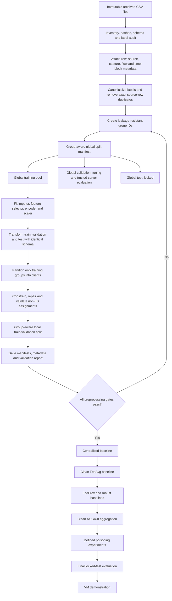

# Edge-IIoTset Federated Learning: Final Implementation Start Plan

## 1. Purpose

This is the implementation-order companion to `Edge-IIoTset_FL_Overall_Workflow_Finalized.md`. It defines what to build first, how each stage should work, and the checks that must pass before federated training begins.

The first milestone is **not** NSGA-II, poisoning, or VM deployment. It is a reproducible, leakage-resistant data pipeline that produces:

- immutable global train, validation, and test manifests;
- fitted training-only preprocessing artifacts;
- valid near-IID and non-IID client manifests;
- client-local train and validation manifests;
- an automated validation report proving that the partitions are usable and disjoint.

Use `DNN-EdgeIIoT-dataset.csv` for reported experiments. Use `ML-EdgeIIoT-dataset.csv` only for quick pipeline smoke tests.

---

## 2. Decisions that are now fixed

- Treat the data as packet-level data with correlated capture, flow, and time structure.
- Create holdouts by capture/flow/time group, not by randomly splitting individual rows.
- Retain identifiers until groups and split manifests exist; then exclude identifiers from model inputs.
- Remove exact duplicate source rows before splitting, and keep equivalent feature vectors in one partition.
- Split into global training, validation, and test data before fitting imputation, categorical encoding, scaling, or data-dependent feature removal.
- Fit all learned preprocessing operations on the global training pool only.
- Partition only the global training pool into clients.
- Constrain and validate every Dirichlet partition; do not accept empty or unusable clients.
- Run binary and multiclass IDS tasks as separate experiments with the same split/client manifests.
- Keep the global test set untouched until every configuration and stopping rule has been frozen.
- Describe label-skew clients as **synthetic non-IID clients**.

---

## 3. Corrected workflow visualization



The key boundary is the global split: nothing that learns replacement values, categories, ranges, means, variances, or retained features may be fitted before that boundary.

---

## 4. Observed dataset facts to assert in code

The archived DNN CSV audit found:

| Check | Observed value |
|---|---:|
| Rows | 2,219,201 |
| Columns | 63 |
| Normal rows | 1,615,643 |
| Attack rows | 603,558 |
| Classes | 15: Normal plus 14 attacks |
| Exact duplicate occurrences | 815 |
| Explicit missing values | 0 |
| Explicit positive/negative infinity | 0 |

The rarest classes are `Fingerprinting` with 1,001 rows and `MITM` with 1,214 rows. Consequently, class presence must be checked after every group split; accuracy alone is not an acceptable metric.

The audit also observed four constant columns in the complete DNN file:

```text
dns.qry.type
http.tls_port
icmp.unused
mqtt.msg_decoded_as
```

Do not hard-code their removal as a substitute for fitting the feature selector. Confirm constant features from the global training pool and save the resulting feature list. This keeps the pipeline correct if another dataset version is used.

---

## 5. Implement in this order

### Phase 0 - Create the reproducible project contract

Create these directories without moving or modifying the archived source files:

```text
data/
  manifests/
  processed/
  clients/
artifacts/
  preprocessing/
  labels/
configs/
reports/
src/
tests/
```

Create one version-controlled configuration containing at least:

```yaml
dataset: DNN-EdgeIIoT-dataset.csv
task: binary
global_split: [0.70, 0.15, 0.15]
time_block_seconds: 300
purge_gap_seconds: 30
clients: 10
dirichlet_alpha: 0.5
minimum_client_samples: 10000
minimum_client_normal: 100
minimum_client_attack: 100
local_validation_fraction: 0.20
maximum_partition_attempts: 1000
seed: 42
```

The exact time-block and purge-gap values may be tuned using training/validation evidence, but they must never be chosen by looking at global test performance.

**Gate 0:** the configuration, software versions, source path, source size, and SHA-256 hash are saved with the run.

### Phase 1 - Implement inventory and schema audit

Build a streaming audit so the 1.13 GB DNN file does not need to be loaded into memory at once.

For every run, record:

- row count, column count, and column names;
- inferred and expected data types;
- missing, infinite, malformed, and duplicate counts;
- binary and multiclass label counts;
- categorical cardinalities;
- the consistency rule `Attack_type == Normal` if and only if `Attack_label == 0`;
- unexpected labels or spelling variants.

Generate `reports/dataset_audit.json`. Abort on malformed rows, inconsistent labels, or an unapproved schema change.

**Gate 1:** the audit reproduces the counts in Section 4 and reports all exceptions explicitly.

### Phase 2 - Attach provenance and grouping metadata

Keep grouping metadata separate from predictors. At minimum, create:

```text
row_id
source_file
capture_id
flow_id
time_block_id
group_id
```

Preferred implementation:

1. Reconstruct the master table from the source Normal/Attack CSV files so `source_file` and capture provenance are explicit.
2. Parse `frame.time` into a real timestamp.
3. Construct a flow identifier from available protocol, source/destination address, and source/destination port fields before those fields are removed.
4. Divide each capture into contiguous time blocks, for example five-minute blocks.
5. Define `group_id` from capture, flow, and/or time block so correlated packets cannot cross partitions.

Fallback when using only the selected DNN CSV:

1. Preserve original `row_id` and `frame.time`.
2. Infer contiguous time blocks from `frame.time`.
3. Form the strongest available flow/session key before removing IP and port fields.
4. Document that capture provenance was reconstructed rather than directly provided.

Do not use `row_id`, timestamps, addresses, ports, source filenames, capture IDs, or group IDs as model features.

**Gate 2:** every row has exactly one stable `row_id` and one non-null `group_id`; group construction is deterministic for the same input and configuration.

### Phase 3 - Perform only split-safe cleaning

Before the global split:

- canonicalize label spelling and data types using fixed, declared rules;
- detect and remove the 815 exact duplicate source rows deterministically;
- preserve a duplicate-resolution log and class counts before/after removal;
- fingerprint the eventual model-feature values and ensure identical vectors cannot be assigned to different global partitions.

Do **not** fit an imputer, encoder, scaler, variance threshold, correlation selector, or any other data-dependent transform here. Although the current DNN audit found no explicit missing or infinite values, the implementation must still handle them after splitting.

Do not interpret protocol-inapplicable zeros as missing values unless the dataset documentation and a declared feature rule justify doing so.

**Gate 3:** no exact source row is repeated, and the cleaning log makes every removed row auditable.

### Phase 4 - Create the immutable global split manifest

Assign complete groups—not individual packets—to approximately:

- 70% global training pool;
- 15% global validation;
- 15% locked global test.

Implementation requirements:

- use group-aware stratification against `Attack_type` where feasible;
- prefer chronological assignment within a capture and add a purge gap between adjacent blocks;
- optimize approximate class balance without breaking group integrity;
- save only one partition per `row_id` and one partition per `group_id`;
- save the manifest before fitting preprocessing;
- never regenerate the split silently when running another model.

If grouping prevents a rare class from appearing in all three partitions, preserve group isolation and document the unsupported evaluation instead of falling back to random row splitting.

Save `data/manifests/global_split.csv` with `row_id`, `group_id`, and `global_partition`.

**Gate 4:** no group, duplicate fingerprint, or row overlaps partitions; every evaluable class has sufficient validation and test support; the test manifest is marked locked.

### Phase 5 - Fit preprocessing on the global training pool only

First define non-feature columns. At minimum exclude:

```text
frame.time
ip.src_host
ip.dst_host
arp.src.proto_ipv4
arp.dst.proto_ipv4
http.file_data
http.request.full_uri
icmp.transmit_timestamp
http.request.uri.query
tcp.options
tcp.payload
tcp.srcport
tcp.dstport
udp.port
mqtt.msg
row_id
source_file
capture_id
flow_id
time_block_id
group_id
Attack_label
Attack_type
```

Then fit, using only global-training rows:

1. missing/infinite-value handling;
2. constant or unusable feature removal;
3. categorical encoding with an unknown-category policy;
4. numerical scaling;
5. fixed output feature ordering.

Recommended rules:

- median imputation for continuous numeric features when required;
- most-frequent or explicit `Unknown` handling for categorical features;
- one-hot encoding with `handle_unknown="ignore"`;
- standardization for continuous numeric variables;
- no scaling for binary indicator columns unless required by the model implementation.

Transform global validation and test data only with the already-fitted training transformer. Never call `fit` or `fit_transform` on either holdout.

Save:

```text
artifacts/preprocessing/transformer
artifacts/preprocessing/feature_order.json
artifacts/preprocessing/dropped_features.json
artifacts/labels/binary_label_map.json
artifacts/labels/multiclass_label_map.json
```

**Gate 5:** train, validation, and test have identical ordered input columns; transformed values are finite; logs prove that fitting used training row IDs only.

### Phase 6 - Construct valid federated clients

Partition only groups from the global training pool. Start with ten clients and generate these matched scenarios:

| Scenario | Suggested setting | Purpose |
|---|---:|---|
| Near-IID | stratified group allocation or `alpha = 10` | Pipeline and FedAvg sanity check |
| Moderate non-IID | `alpha = 0.5` | Primary initial label-skew experiment |
| Strong non-IID | `alpha = 0.1` | Stress test |
| Specialists | declared attack-dominant assignments | Attack-expertise study |

For Dirichlet label skew:

1. draw client proportions per `Attack_type` from a seeded Dirichlet distribution;
2. allocate complete groups to approximate those proportions;
3. validate all constraints;
4. resample up to `maximum_partition_attempts` if constraints fail;
5. if still invalid, repair by moving whole groups and record every repair;
6. reject the scenario if repair would destroy the requested degree of heterogeneity.

Initial binary-task validity constraints:

- at least 10,000 total samples per client;
- at least 100 Normal and 100 attack samples per client before local splitting;
- at least 20 Normal and 20 attack samples in each local validation set;
- at least two target classes in local training;
- no group or row assigned to multiple clients.

For the multiclass task, do not require all 15 classes at every client—that would erase the intended non-IID condition. Require at least two local training classes and report unsupported local classes. Use global validation/test metrics for complete cross-class comparisons.

Save one immutable client manifest per scenario and seed. Also compute quantitative heterogeneity measures, such as per-client class proportions and Jensen-Shannon divergence from the global training distribution.

**Gate 6:** every client satisfies the declared constraints, all training rows are assigned exactly once unless subsampling is explicitly configured, and measured heterogeneity agrees with the scenario name.

### Phase 7 - Create group-aware local train/validation manifests

Within each client, assign complete groups to approximately 80% local training and 20% local validation.

- preserve the client's non-IID distribution as closely as group integrity permits;
- enforce the local class-support constraints from Phase 6;
- do not use the global validation or global test data as client-local data;
- store local partitions as row-ID manifests rather than repeatedly copying the raw source table.

Local validation may support early stopping in honest-client experiments. It must not be trusted as a client-reported aggregation score in Byzantine experiments. Later NSGA-II quality objectives should use server-observable update statistics and the trusted global validation/calibration data.

**Gate 7:** each client has disjoint local train/validation groups and trainable label support; no row belongs to a global holdout.

### Phase 8 - Run the final pre-training validator

Automate these assertions:

- source hashes and schema match the recorded dataset manifest;
- no row/group overlap among global train, validation, and test;
- no duplicate feature fingerprint crosses global partitions;
- no row/group overlap among clients;
- no overlap between client-local train and validation data;
- preprocessing fit IDs are a subset of global-training IDs;
- no fitted artifact used global validation or test rows;
- every transformed table has the same feature count and order;
- no NaN or infinity remains;
- binary and multiclass label maps are fixed and complete;
- all client size and class-support constraints pass;
- every scenario has saved seeds, alpha, group rules, and repair logs;
- the global test set has not been read by training or tuning code.

Write `reports/pretraining_validation.json` and fail the run if any required assertion fails.

**Gate 8:** federated model code may start only when the report status is `PASS`.

---

## 6. What to train after preprocessing passes

Run models in this order; preserve the same manifests, feature pipeline, and matched seeds throughout:

1. majority-class and simple non-neural sanity baselines;
2. centralized MLP on the complete global training pool;
3. clean FedAvg under near-IID allocation;
4. clean FedAvg under moderate and strong non-IID allocations;
5. FedProx or another recognized heterogeneity baseline;
6. robust aggregation baselines such as coordinate median or trimmed mean;
7. clean NSGA-II aggregation using global validation—not test—for fitness;
8. separately specified poisoning experiments;
9. one final evaluation of frozen checkpoints on the locked global test set;
10. VM deployment as a systems demonstration.

Run the binary experiment first. Once it is stable, run the independent 15-class experiment using the same data manifests. Do not use one target as a predictor for the other.

---

## 7. Minimum client and run metadata

For every client, scenario, seed, and FL round, retain:

- client ID, group IDs, and partition seed;
- Dirichlet alpha and any repair operations;
- local train/validation sample counts;
- Normal, attack, and per-`Attack_type` counts and proportions;
- preprocessing and model version;
- participation status and effective sample count;
- update norm, cosine similarity, and clipping status;
- local training time and transmitted bytes.

For global results, report binary F1, PR-AUC, recall, false-positive rate, and false-negative rate. For multiclass results, report macro-F1, balanced accuracy, per-class precision/recall/F1, and support. Always show MITM and Fingerprinting support alongside their metrics.

---

## 8. Files the preprocessing implementation must produce

```text
data/manifests/dataset_manifest.json
data/manifests/global_split.csv
data/manifests/clients/<scenario>/<seed>/client_assignments.csv
data/manifests/clients/<scenario>/<seed>/local_splits.csv
artifacts/preprocessing/transformer
artifacts/preprocessing/feature_order.json
artifacts/preprocessing/dropped_features.json
artifacts/labels/binary_label_map.json
artifacts/labels/multiclass_label_map.json
reports/dataset_audit.json
reports/deduplication_report.json
reports/split_report.json
reports/client_distribution_report.json
reports/pretraining_validation.json
configs/<scenario>.yaml
```

Prefer manifests containing stable row IDs over duplicated multi-gigabyte client CSVs. Materialize client arrays or batches from the manifest when training begins.

---

## 9. Immediate implementation checklist

Implement only the following first:

- [ ] Create the configuration and directory contract.
- [ ] Implement the streaming dataset audit and reproduce the known counts.
- [ ] Attach stable row, flow, and time-block grouping metadata.
- [ ] Remove and log exact duplicates.
- [ ] Generate and validate a group-aware 70/15/15 global split manifest.
- [ ] Fit and save preprocessing using global-training row IDs only.
- [ ] Generate a ten-client near-IID manifest and prove all validity checks pass.
- [ ] Generate a ten-client `alpha = 0.5` manifest with constraints and repair logging.
- [ ] Generate group-aware local train/validation manifests.
- [ ] Produce a passing `pretraining_validation.json`.

Do not begin FedAvg until these ten items pass. Do not begin NSGA-II until clean centralized, FedAvg, heterogeneity, and robust baselines are reproducible. Do not introduce poisoning until the clean NSGA-II experiment is stable. Do not evaluate on global test until the full protocol is frozen.

---

## 10. Definition of preprocessing complete

Preprocessing is complete only when another researcher can use the saved source hash, configuration, manifests, and preprocessing artifacts to reconstruct exactly the same global partitions and clients without consulting undocumented notebook state.

At that point, the first defensible FL experiment is:

```text
Binary IDS
10 clients
clean data
near-IID versus alpha=0.5 non-IID
centralized MLP versus FedAvg
matched seeds and identical global holdouts
global validation for selection
locked global test for one final evaluation
```

That experiment establishes the trustworthy baseline on which FedProx, robust aggregation, NSGA-II, poisoning, and VM demonstrations can be added in order.
